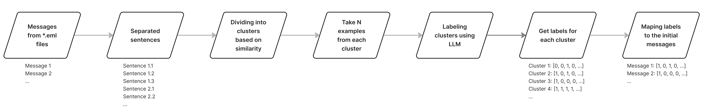
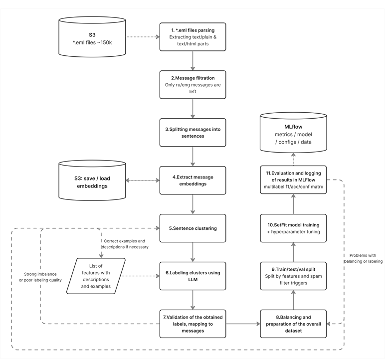

# Phishing pattern detection system

This repository contains a machine learning system for detecting phishing and fraud-related patterns in email content.  
The project focuses on fine-grained, interpretable multi-label classification of emails instead of coarse spam detection.

The system identifies multiple high-risk intent signals in a single email, enabling proactive security monitoring and incident response.


## Problem Statement

Sophisticated phishing emails increasingly bypass standard spam and security filters by mimicking legitimate business communication.  
As a result, organizations face data breaches, credential theft, and financial losses.

Most existing solutions provide only a binary decision (spam / not spam) and do not explain *what kind of threat* is present in the message.  
Manual analysis is not feasible at scale.


## Machine learning task

**Task type:**  
Multi-label text classification.

**Input:**  
Email body text extracted from `.eml` files after parsing and cleaning.

**Output:**  
A binary vector of length N, where N is the number of target phishing/fraud features.

Example:
[p1, p2, ..., pN]  
p_i = 1 if the corresponding feature is present in the email, otherwise 0.

**Current status:**  
A trained model achieves high predictive quality with F1-score > 0.9 across ALL 22 target features.


### Processing Steps
- Parsing `.eml` files
- Extracting `text/plain` and `text/html` parts
- HTML cleaning and decoding
- Language filtering
- Sentence splitting

### Labeling
Labels are generated using a Large Language Model (LLM) based on predefined feature descriptions and examples.


### Dataset splits
Training, validation, and test splits are created with explicit consideration of feature distribution and class imbalance.

## High-level pipeline

1. Load raw `.eml` files from S3  
2. Parse emails and extract text/plain and text/html content  
3. Filter messages by language  
4. Split messages into sentences  
5. Extract sentence or message embeddings  
6. Cluster semantically similar sentences  
7. Label clusters using an LLM and predefined feature descriptions  
8. Validate labels and map them back to full messages  
9. Balance and prepare the final dataset  
10. Train a SetFit-based multi-label classifier with hyperparameter tuning  
11. Evaluate results and log metrics, models, and artifacts to MLflow



## Repository Structure

*configs/*  
Configuration files for experiments, models, and pipelines.

*hnsw_clustering/*  
Sentence embedding clustering based on HNSW for scalable similarity search.

*inference_validate/*  
Inference and validation utilities.

*labeling/*  
LLM-based cluster labeling and label validation logic.

*model/*  
Model training, evaluation, and optimization code.

*prepare_data/*  
Email parsing, cleaning, filtering, sentence splitting, and dataset preparation.

*setfit_onnx/*  
ONNX export pipeline for trained SetFit models.

*templates/*  
Prompt templates and auxiliary resources used during labeling.

*datamodels.py*  
Shared data models and schemas.

*logger.py*  
Centralized logging utilities.

*mlflow_helper.py*  
MLflow experiment tracking and artifact logging.

*paths.py*  
Centralized path and directory management.

*settings.py*  
Global project settings and configuration handling.

*utils.py*  
Common helper utilities.

*visualization.py*  
Visualization and analysis helpers.

*.env.example*  
Example environment variable configuration.


## Training and export scripts

The project uses Poetry scripts defined in `pyproject.toml`.

Available scripts:

- *train*  
  Runs the full training pipeline, including dataset preparation (if required), model training, and evaluation.

- *onnx_export*  
  Exports a trained SetFit model to ONNX format for production inference.

## Expected outcome

The system provides an automated, scalable solution for detecting fine-grained phishing and fraud patterns in email content.

It enables security teams to:
- Understand the intent behind malicious emails
- Prioritize incidents based on threat type
- Respond proactively to emerging phishing and fraud campaigns

## Quick start

### Prerequisites

- Python 3.10.11
- Poetry
- Access to required data sources (e.g. S3 bucket with `.eml` files)
- Environment variables configured (see `.env.example`)

---

### Installation

Clone the repository and install dependencies:

```bash
git clone <repository-url>
cd <repository-name>
poetry install
```

Activate the virtual environment:

```bash
poetry shell
```

---

### Environment configuration

Create a `.env` file based on the provided example:

```bash
cp .env.example .env
```

Fill in the required values

---

### Model training

Run the full training pipeline:

```bash
poetry run train
```

This command:
- Prepares and preprocesses the dataset (if not already prepared)
- Trains a multi-label SetFit model
- Evaluates performance on validation and test splits
- Logs metrics, artifacts, and the trained model to MLflow

---

### Model export to ONNX

Export a trained model for production inference:

```bash
poetry run onnx_export
```

The exported ONNX model can be used in downstream services for fast and portable inference.
